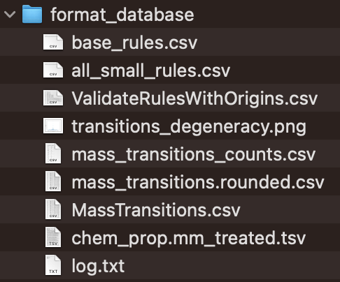
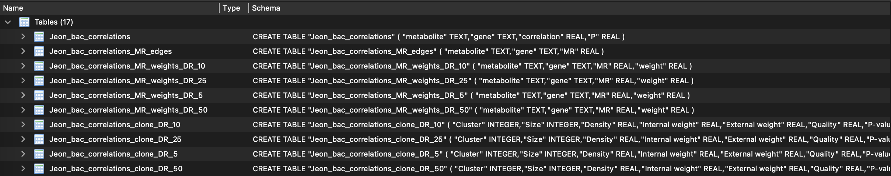
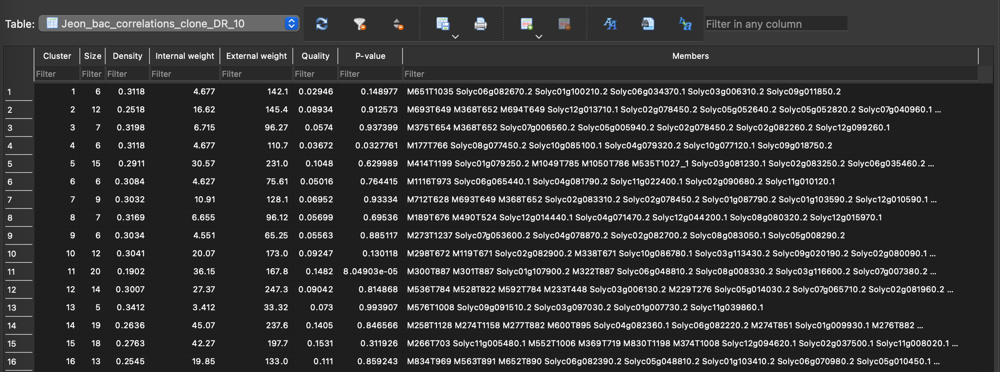
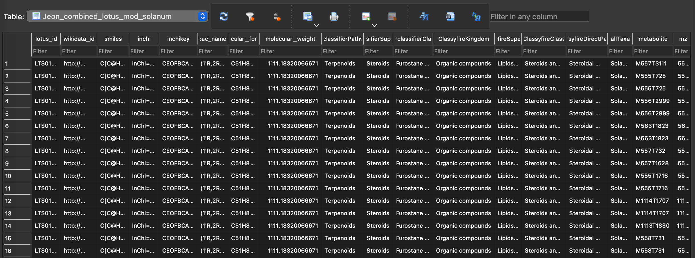
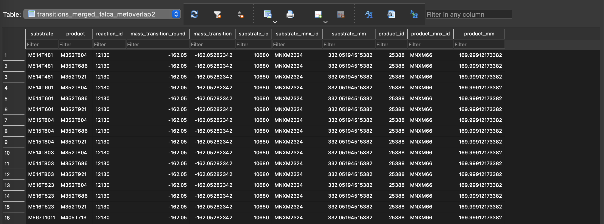
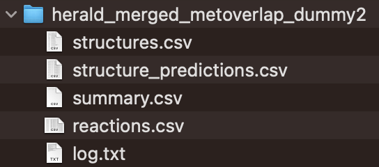
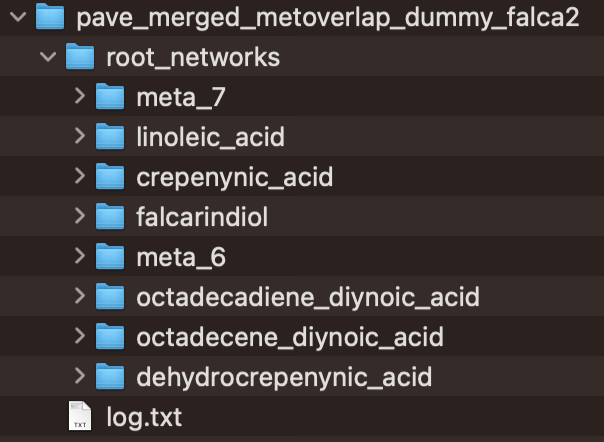
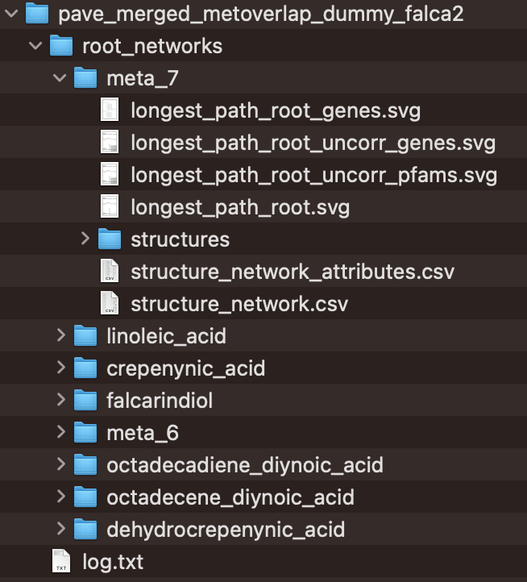

Results
========

Format Database
~~~~~~~~~~~~~~~~

The first output is from the *formatDatabase.py* script where multiple files are genrated in the *format_database* folder.

*mass_transitions.csv*

This script processes the RetroRules and MetaNetX databases to create a CSV file containing reaction IDs and their corresponding mass transitions. 

It further refines and analyzes the mass transitions generated in the previous step to ensure compatibility with those identified by RDKit during the virtual molecule generation (VMG) process.

*transition_degeneracy.png*

This script also produces visualizations depicting transition degeneracy, answering questions such as how many reactions correspond to a specific mass transition value.

*validateruleswithorigin.csv*

This file validates SMILES structures in the RetroRules database against metabolites in the MetaNetX database. Since small differences exist between the two databases, this step filters out rules with mismatched structures, retaining only those with identical molecular structures as described in MetaNetX.

Furthermore, the molecular structures in RetroRules are represented across various diameters (substructures). Many of these substructures are either identical across multiple rules or are components of more complex structures in other rules. The formatting step identifies and outputs these relationships to optimize the speed of rule testing against metabolome data. For example, a rule involving the substructure `C-N-C` does not need testing for a molecule if a rule involving the smaller substructure `C-N` was already tested and found absent in the molecule.

*baserules.csv*

This file contains reaction rules that describe substructures which cannot be further decomposed into smaller substructures present in RetroRules. These "base rules" are the starting point for testing metabolome data.

*smallrules.csv*

This file includes reaction rules represented at their smallest diameter as defined in the RetroRules database.

Correlation
~~~~~~~~~~~~

The results of correlation analysis is available in the SQLite database under the database table with a name provided by the user.

Correlations are transformed into mutual ranks, which are then converted into edge weights for each specified decay rate value. The default decay rates are 5, 10, 25, and 50. In the database, you will find one table containing correlation values and another with mutual ranks. Edge weights are calculated for individual networks (corresponding to each decay rate) and are labeled as DR in the database table.

Each individual network, defined by its specific decay rate, is clustered using the ClusterONE tool. The resulting modules, referred to as functional clusters (FCs) in our work, are stored as separate tables in the database. For instance, in the table *Jeon_bac_correlations_clone_DR_10* shown in the figure above, each row represents a functional cluster (FC) derived from the network with decay rate value of 10.

Structure database mapping
~~~~~~~~~~~~~~~~~~~~~~~~~~~

The results are saved in an SQLite database, where each mass feature is linked to a structural database ID. By default, the LOTUS database is used, but users can opt to use a custom database provided it follows the same format.

Map mass trantions
~~~~~~~~~~~~~~~~~~

This step integrates metabolome and transcriptome data with RetroRules and MetaNetX datasets. It filters mass transitions associated with RetroRules reactions based on the mass signatures present in the metabolome. Each mass signature is then designated as a substrate or product according to reactions in the RetroRules database.

**Reaction step prediction**

This step integrates all data to produce pathway predictions. The results are either written in CSV files or exported to the SQLite database.

This step generates several output files. The *summary.csv* file provides an overview of the total structures (or virtual molecules) generated after each iteration. The initial structure count corresponds to the unique structures identified during the structural database mapping step.

The *structures.csv* and *structure_predictions.csv* files detail the mass signatures assigned as substrates and their resulting products following the virtual molecule generation process.

The *reactions.csv* file serves as the primary results file, offering a comprehensive summary of the predicted reactions, the structures associated with those reactions, and their correlated enzymes.

Visualization
~~~~~~~~~~~~~~

This step utilizes *paveWays.py* script and creates tables and visualizations from the predicted reactions that are easier to interpret. This includes a folder with SVGs, and tables describing the predicted pathways, structures and their characteristics

The CSV files, *structure_network.csv* and *structure_network_attributes.csv*, offer data to help users prioritize reactions for experimental validation. This includes details such as enzyme support values and reaction likelihood scores.