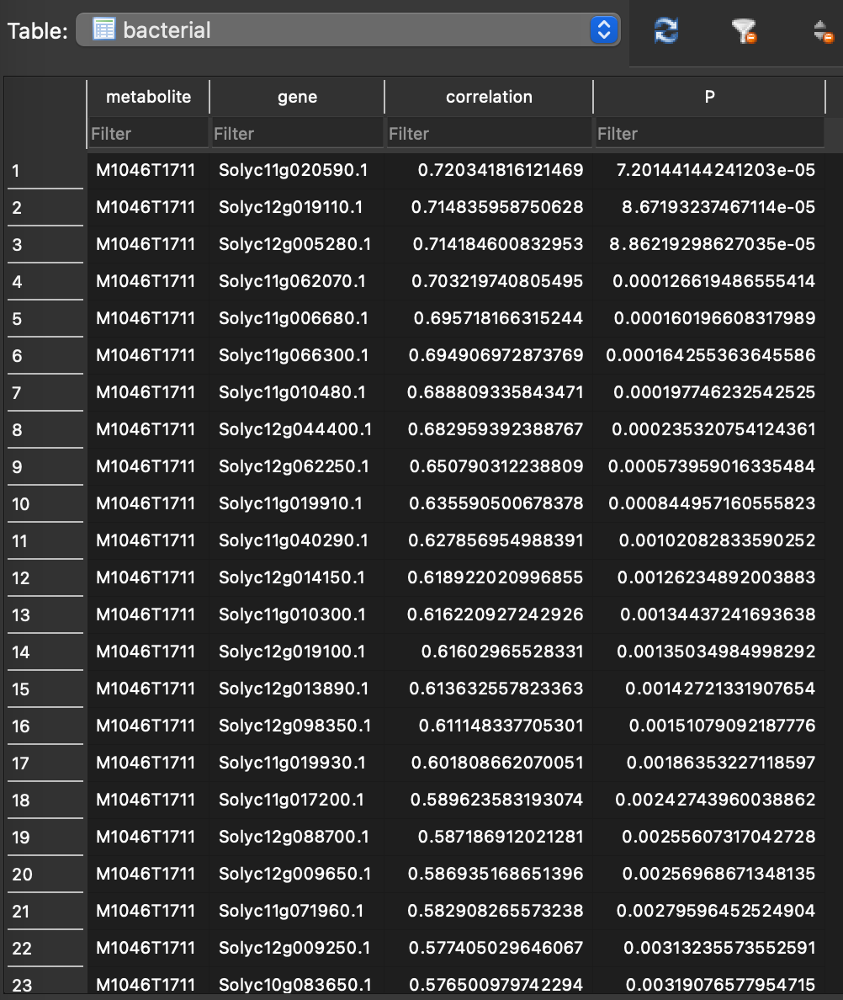

Tutorial
=============
   
The tutorial's test data can be found in the *data* folder of the GitHub repository. These datasets are a subsampled version of the multi-omics data sourced from Jeon et al., 2020. The test data includes three omics-related files along with accessory files:

#. Metabolomics abundance data: `data/test_data/test.bac.abundance.csv`
#. Metabolomics m/z data: `data/test_data/test.bac.metabolome.csv`
#. Transcriptomic expression matrix: `data/test_data/test.bac.rnaseq.rpkm.csv`

The RetroRules database is up-to-date and ready to use. The *formatDatabase.py* script is necessary only if you need to format older or revised database versions."

**Step 1** Query the LOTUS database
~~~~~~~~~~~~~~~~~~~~~~~~~~~~~~~~~
	
``queryMassNPDB_mod.py -add docs/ESI-MS-adducts.csv -ms Jeon_tomato/test_data/test.bac.metabolome.csv -db lotus -dbp demo.sqlite -dtn Jeon_dummy_falcarindiol -t Solanum -dn test.sqlite -tn test_metabolites -c 20 -p 20 -v True``

	.. note::
		The adducts file is available in the github repository *data/ESI-MS-adducts.csv*

**Output**

The script tentatively assigns annotations to each mass feature by identifying adducts and matching structures from the database to the ppm-adjusted precursor ion mass. 

The outcomes are saved in the test.sqlite database within the *test_metabolites* table. The test data contains a total of 363 mass features, which, after processing with the *queryMassNPDB_mod.py* script, produced 2386 rows. This indicates that multiple structures are associated with each mass feature. 

**Step 2** Correlation analysis
~~~~~~~~~~~~~~~~~~~~~~~~~~~~~~~~

	.. note::
		Make sure to keep the same column names in the transcriptomics and metabolomics CSV files

``corrMultiomics_mod.py -ft Jeon_tomato/test_data/test.bac.abundance.csv -qm Jeon_tomato/test_data/test.bac.rnaseq.rpkm.csv -mr -cl -mad -r -c 0.1 -w 0.01 -mdr 5 10 25 50 -t 4 -dn test.sqlite -tn bacterial``

This step saves the results in the test.sqlite database across various tables. The initial table, named *bacterial*, stores the correlation between each mass feature and individual transcripts/genes. Each correlation coefficient is accompanied by a p-value, indicating its statistical significance. 

Correlation script converts correlation value into mutual ranks (MR). This information is stored in the database as *bacterial_MR_edges* table.

.. image:: images/correlation2.png
   :width: 800

These MR values are processed through a decay function that transforms mutual ranks into edge scores. This transformation is crucial because the MR value can be as large as the number of features minus one (n-1, where n is the total number of features). To construct a network, a number between 0 and 1, derived from the MR, is required for use as edge weights. By default, MEANtools generates four networks using four different decay rates (5, 10, 25, & 50). The results are stored in four tables corresponding to these rates, named: *bacterial_MR_edges_DR_5*, *bacterial_MR_edges_DR_10*, *bacterial_MR_edges_DR_25*, and *bacterial_MR_edges_DR_50*.

	.. note::
		Users can choose decay rates larger than 50, depending on the expected size of the network. For more information refer, Wisecaver et al. 2017.

To identify functional clusters (FCs; also known as modules or network hubs) within each corresponding network, MEANtools employs ClusterONE, a tool that utilizes edge weights to group genes and metabolites exhibiting similar expression and abundance patterns. The outcomes from ClusterONE are stored in four tables named: *bacterial_clone_DR_5*, *bacterial_clone_DR_10*, *bacterial_clone_DR_25*, and *bacterial_clone_DR_50*.

In this table, each row corresponds to a functional cluster. Various columns detail the characteristics of the FC, including its id, size (the count of genes and metabolites within the FC), density, the number of internal edges, the number of external edges, quality, and a p-value (which is calculated based on the inflow and outflow of edges from the FC). The final column enumerates the genes and metabolites, separated by spaces.

	.. note::
		Users can use this file to create networks using the *plot_graph.py* script.

**Step 3** Merge Functional Clusters
~~~~~~~~~~~~~~~~~~~~~~~~~~~~~~~~~~~~~

After completing the correlation step, proceed to analyze the functional clusters derived from each network using different decay rates. This script facilitates the annotation of functional clusters and enables investigation into whether genes and metabolites from known pathways cluster together. Additional scripts provided in the GitHub repository can be used to generate network graphs based on these functional clusters.

``merge_clusters.py -ft Jeon_tomato/test_data/test.bac.abundance.csv -qm Jeon_tomato/test_data/test.bac.rnaseq.rpkm.csv -a -f Jeon_tomato/annotation/tomato.new.pfams_description.csv -mc -mm overlap -dr 25 -dn test.sqlite``

Based on the selected method for merging functional clusters, the script will combine FCs that share a common metabolite. The results of this merging process will be stored in the test.sqlite database under the table named *merge_cluster_overlap_metabolite_DR_25*. This table name reflects the merging method used (overlapping), the feature that prompted the merge (metabolite), and the network type (DR=25). The table consists of an identifier and merged genes and metabolites. This would be the final list of genes and metabolites that you want to take further to the prediction step. 

**Step 4** Map mass transitions
~~~~~~~~~~~~~~~~~~~~~~~~~~~~~~~~

This step combines metabolome and transcriptome data with information from RR and MetaNetX. Essentially, it filters mass transitions linked to RR reactions based on the mass signatures present in the metabolome. For example, if there are no metabolites with a mass of 1000 in the metabolome, then the script will exclude reactions that involve masses of 1000.

``pathMassTransitions_mod.py -c Jeon_tomato/test_data/test_merged_cluster_filtered.csv -t test_db/format_database/MassTransitions.csv -dn test.sqlite -tn transitions_test -ct bacterial -mt test_metabolites -p pfam_RR_annotation_file.csv -a Jeon_tomato/Bacterial/bacterial.tomato.pfams.sol.csv -s loose -cc 0.1 -cpc 1 -v``

This step saves the results in the test.sqlite database within *transitions_test*. The script categorizes each meass feature as substrate and product and maps mass transitions estimated from the format database step. 

**Step 5** Predict reaction steps
~~~~~~~~~~~~~~~~~~~~~~~~~~~~~~~~~~

This script integrates all data to produce pathway predictions. Here, all input is integreated, and all results are output as CSV tables that can be examined in a text editor, EXCEL, cytoscape.

``heraldPathways_mod.py -c Jeon_tomato/test_data/test_merged_cluster_filtered.csv -r test_db/format_database/ValidateRulesWithOrigins.csv -m test_db/format_database/base_rules.csv -p pfam_RR_annotation_file.csv -a Jeon_tomato/Bacterial/bacterial.tomato.pfams.sol.csv -s loose -i 3 -dn test.sqlite -tn test_herald -ct bacterial -mt test_metabolites -tt transitions_test_falca -v -dv -o test_herald -d pfams_dict.csv``

	#. The first output file is a summary (Summary.csv) of the number of structures predicted in multiple iterations. Here initial structure is the number of stricture in the database. New structures are predicted in the virtual molecule generation process.

	.. list-table:: Summary.csv 
   		:widths: 20 20 20 20 20
   		:header-rows: 1

   		* - iteration
     		- 3
   		* - initial_structures
     		- 8
   		* - fresh_structures
     		- 372
   		* - new_structures
     		- 376
   		* - final_structures
   	 		- 380

   	#. The second and third file output structures predicted along with their SMILES.

   	.. list-table:: Structures.csv 
   		:widths: 50 50
   		:header-rows: 1

   		* - predicted_substrate_id
     		- linoleic_acid
     		- dehydrocrepenynic_acid
     		- octadecene_diynoic_acid
     		- octadecadiene_diynoic_acid
   		* - predicted_substrate_smiles
     		- CCCCC/C=C\C/C=C/CCCCCCCC(=O)O
     		- CCCC=CC#CCC=CCCCCCCCC(=O)O
     		- CCCC#CC#CCC=CCCCCCCCC(=O)O
     		- C=CCC#CC#CCC=CCCCCCCCC(=O)O

     #. The third file constitutes the main results of the prediction. It is a CSV that list all mass features, mass transitions, structure annottaion, predicted reaction, SMILES, SMARTS, PFAM description, enzymes annotation, and correlations. 

     **Named columns**
     ``ms_substrate	ms_product	expected_mass_transition	predicted_mass_transition	mass_transition_difference	reaction_id	substrate_id	product_id	substrate_mnx	product_mnx	root	predicted_substrate_id	predicted_product_id	predicted_substrate_smiles	predicted_product_smiles	smarts_id	diameter	RR_substrate_smarts	RR_product_smarts	uniprot_id	uniprot_enzyme_pfams	KO	rhea_id_reaction	kegg_id_reaction	rhea_confirmation	kegg_confirmation	KO_prediction	gene	enzyme_pfams	correlation_substrate	P_substrate	correlation_product	P_product``

**Step 6** Generate reaction graphics
~~~~~~~~~~~~~~~~~~~~~~~~~~~~~~~~~~~~~~
This step refines the results by producing visualizations and curated tables of predicted pathways, making them simpler to interpret. It generates tables and visualizations from the predicted reactions, filtering based on user specifications. The essential input for this script is the structure predictions from heraldPathways.

``paveWays.py -sp test_herald/structure_predictions.csv -of test_paveWays -r test_herald/reactions.csv -praf pfam_RR_annotation_file.csv -gaf Jeon_tomato/Bacterial/bacterial.tomato.pfams.sol.csv -rr loose -pam True -pup True -v``

The resulting folder structure looks like this:

The root structures are coming from the reactions file. Within root structures are the reaction steps (in SVG format) and CSV files that detail the reaction structures and scores (enzyme weight, edge weight and reaction score) asociated with each reaction step.

