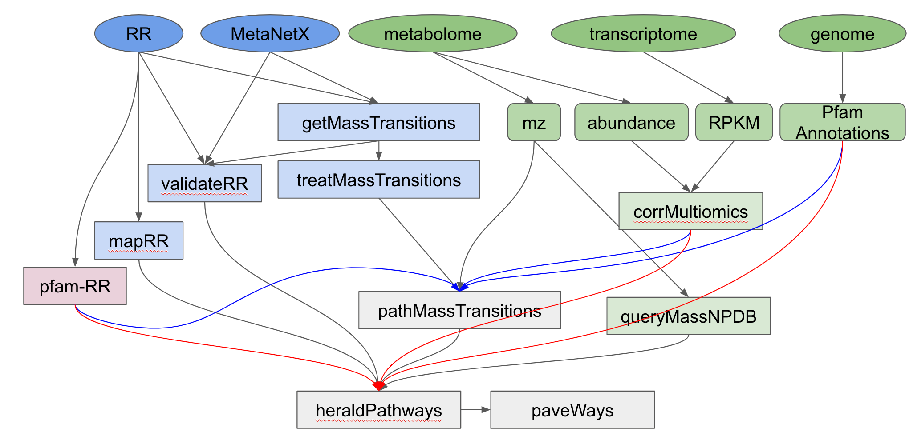
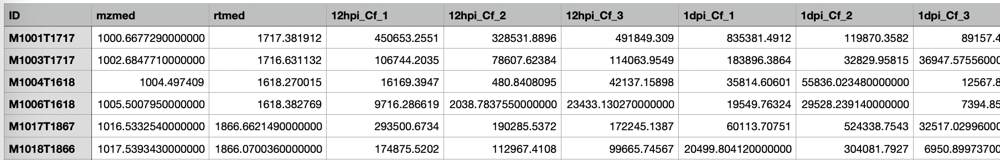
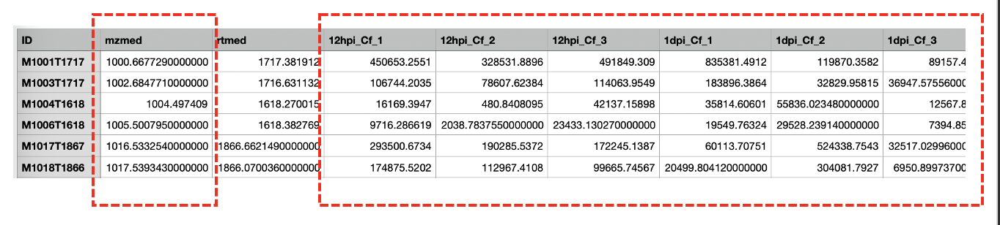

Usage
=====

**Databases availability**
~~~~~~~~~~~~~~~~~~~~~~~~

* The MetaNetX database release ``chem_prop.tsv``, which can be downloaded from their website: https://www.metanetx.org/mnxdoc/mnxref.html

* The RetroRules database version "rr_01" in SQLite (named ``mvc.db``), which can be downloaded from their website: https://retrorules.org/dl

* The ``Retrorules-Pfam annotations``, which have been curated and can be found in the github repository.

* ``LOTUS database`` is available in the form of an sqlite database within the GitHub repository.

**Database Preparation**
~~~~~~~~~~~~~~~~~~~~~~~

**These steps only need to be performed once: upon downloading the RetroRules database**.

Two inputs are needed for this:

#. The MetaNetX database release "chem_prop.tsv", which can be downloaded from their website: https://www.metanetx.org/mnxdoc/mnxref.html
#. The RetroRules database version "rr_01" in SQLite (named mvc.db), which can be downloaded from their website: https://retrorules.org/dl

``formatDatabase.py``

   This script does the following to prepare RetroRules content in a format required by MEANtools:

   * The script parses the RetroRules and MetaNetX database to generate a CSV with reaction_ids and their associated mass_transitions. 

   .. note::
   Using the monoisotopic mass is recommended, with the optional flag: --*monoisotopic_mass*

   * It rounds and analyses the mass_transitions generated in previous step to make it compatible with the mass transitions that will later be identified by rdkit during the virtual molecule generation process. This script also generates some plots showing the transition degeneracy (answering questions such as how many reactions can be attributed to a specific mass_transition number).

   * It validates the SMILES in RetroRules reactions with that of the metabolites in MetaNetX. This is because some SMILES have small differences across the two databases. This script basically filters out these rules, leaving only those in which the molecular structures involved are identical as those described by MetaNetX. 

   .. note::
   Using the optional flag --*use_greedy_rxn* is recommended. This flag will make the validation tests ignore differences in missing or extra H atoms (valence).

   * This script maps the relationships among rules in RR. Because the molecular structures in RR rules are all described in different diameters (substructures), many of these substructures are identical across several rules, or are substructures of more complex structures in other rules. This script identifies and output these relationship to optimize the speed at which rules are tested with the metabolome data. For example, this script will identify that a rule involving the substructure C-N-C does not need to be tested for a specific molecule if a rule involving the substructure C-N was already tested and was not found in the molecule.

   * This script generates multiple following files:

      *MassTransitions.csv* : Mass transitions estimated from the known reactions. 

      *ValidateRulesWithOrigins.csv* : List of validated rules. 

      *Base rules*: are the reaction rules that describe substructures that cannot be further decomposed in smaller substructures that are also in RetroRules. Base rules represent step number one in testing the metabolome data.

      *Small rules*: are the reaction rules described at their smallest diameter, as found in RR.

**MEANtools workflow**
~~~~~~~~~~~~~~~~~~~~~~

Arrows:
~~~~~~~~
* Arrows in this workflow show where the input of which script comes from.

* Grey arrows show the simplest workflow: only using metabolome information.

* Red and blue arrows show the additional steps when using transcriptome data as well. Introducing transcriptomic data acts as a filter: reactions without associated correlated transcripts are filtered out. Because of this, when using the blue arrows (recommended), the red arrows are not necessary.

Squares:
~~~~~~~~
* Blue-colored squares are the DATABASE PREPARATION phase. These scripts parse the RetroRules database to extract the data pertinent to MEANtools. These steps only need to be performed once: upon downloading the RetroRules database.

* Green-colored squares are the OMICS DATA PREPARATION phase.

* Red-colored square is a list annotating the data from the RetroRules database and its PFAM predictions. This can be downloaded from #TODO.

* Grey-colored squares are the PREDICTION phase.

**Input Description**
~~~~~~~~~~~~~~~~~~~~

Metabolomics data
~~~~~~~~~~~~~~~~~~

A feature table from the metabolomics data is a processed data file where rows represent individual features and columns are different variables. For example, a typical feature table has columns like m/z, retention time (RT), and abundance/area-under-the-curve of each feature across samples. 

MEANtools processes the m/z and abundance inforation as separate files. So keeping the feature column intact, it is required that you create two csv files one with feature ids and m/z and another with feature ids and abundance values. Name these files in such a way that you remember which file has which information. 

File with abundance values will be used in the correlation step, where as file with m/z values will be used in the step where LOTUS database is queried. 

``queryMassNPDB.py`` is used to query the m/z ratio CSV described above in a custom CSV list of molecules (and their monoisomeric mass), or LOTUS database stored as sqlite formatted database. When using a custom list of molecules, this is the format required:

   . list-table::
   :widths: 40 20 40
   :header-rows: 1

   * - Molecule ID
     - natural_product_1
     - natural_product_2
   * - molecule_monoisomeric_mass
     - 70
     - 180
   * - SMILES
     - CCCO
     - CCCCCCCCNC

.. note::
Matching mass/charge ratio data with metabolite structures requires a library of ions indicating how they affect the m/z ratio of a structure. This is provided within the github repository as a csv file. 

A CSV with the metabolome abundance of each metabolic feature (rows) in each sample (columns). A header must be included, ``with each sample being identically named in the transcriptome``.

   . list-table::
   :widths: 15 15 70
   :header-rows: 1

   * - Metabolite ID
     - metabolite1
     - metabolite2
   * - Sample1
     - 100
     - 400
   * - Sample2
     - 300
     - 500

Transcriptomics data
~~~~~~~~~~~~~~~~~~~~~

A CSV with the transcriptome abundance (expression mnatrix from the transcriptome data) of each locus_tag (rows) in each sample (columns). A header must be included, with each sample being identically named in the metabolome abundance file.

   . list-table::
   :widths: 15 15 70
   :header-rows: 1

   * - Gene ID
     - gene1
     - gene2
   * - Sample1
     - 55
     - 77
   * - Sample2
     - 66
     - 88

The above two files are used by ``corrMultiomics.py`` to generate a list of correlated metabolite-transcripts pairs. The correlation output is directly saved in the SQLIte database in the following format with a table name suffixed with ``*_correlation``:
metabolite,gene,correlation,P

   . list-table::
   :widths: 20 20 30 30
   :header-rows: 1

   * - Metabolite ID
     - metabolite1
     - metabolite2
   * - Gene ID
     - gene1
     - gene1
   * - Correlation coeffecients
     - 0.7
     - 0.6
   * - P-value
     - 0.001
     - 0.0001

A CSV with PFAM annotations of the genes in the transcriptome. This can be integrated with the rest of the data at different steps (see workflow picture and help commands of each script). The format for these annotations is as follows (note that multiple pfams for a given gene can be be separated by semicolons ;):

   . list-table::
   :widths: 30 80
   :header-rows: 1

   * - Gene ID
     - gene1
     - gene2
     - gene3
   * - Description
     - p450
     - Transferase
     - SQHop_cyclase_C;SQHop_cyclase_N

OMICS DATA PREPARATION
~~~~~~~~~~~~~~~~~~~~~~~

``queryMassLOTUS.py``

   This script will query a metabolome described in a CSV table of IDs and associated mass/charge ratios to produce a list of predicted structures to each ID. The metabolome can be queried in a custom CSV table of structures (see input descriptions section above), or a NPDB database in SQLite.

   **Input**
      * LOTUS SQLite database.
      * CSV of feature_id,m/z
   **Output**
      * The script creates a table in the project's SQLite database.
      * CSV of structure predictions for each mass_signature (Optional)

``corrMultiOmics.py``

   This script will correlate the metabolome abundances with the transcriptome abundances, and return a list of annotated and correlated pairs, according to customizable score, P-value and MAD thresholds. The script also converts the correlation scores into mutual-rank (MR) [Wisecaver et al., 2017] and by using an exponential function converts mutual ranks into edge scores. The script combinely use 4 decay rates (For details check the paper) to generate 4 networks of variable size. Users can also optionally provide their own set of decay rates or use only one decay rate. 

   **Input**
      * Transcriptome (RPKM)
      * Metabolome (mass_signature abundance per sample)
   **Output**
      The script creates multiple tables in the project's SQLite database.

``merge_clusters.py``
   The use of mutual-rank statistics has proven effective for constructing global gene co-expression networks, as demonstrated by Wisecaver et al. (2017). Leveraging this approach, we utilized the mutual rank-based method to develop a correlation-based global gene-metabolite network. This network highlights strongly correlated genes and metabolites. Ideally, individual functional clusters (FC) should advance to the next stage of pathway prediction. However, the FC’s size may sometimes be insufficient for forming a complete biosynthetic pathway. Given that genes and metabolites in plant biosynthetic pathways tend to overlap, FCs are also overlapping in nature. MEANtools provides a script (*merge_clusters.py*) to merge multiple FCs that share common mass features. Mass features that exhibit distinct abundance patterns across samples are then grouped into separate clusters following this merging process. This step is crucial for ensuring enough mass features and transcripts remain to either fully or partially reconstruct a biosynthetic pathway.

   The script has different method to merge a network:
   1. *overlap* : this method looks for shared metabolites among functional clusters
   2. *fingerprinting* : details are in the MEANtools paper (not recommended for larger networks).
   3. *Similarity network* : this method takes co-expression or spectral network using -e parameter (evidence) and specifiying which similarity network it is by -es (evidence support). The script will use similarity network to look for commonalities in nodes to merge functional clusters. 

   **Input**
      * Transcriptome quantitation matrix (CSV)
      * Metabolomics feature table (CSV)
      * PFAM annotation file (csv)
      * Name of the project's sqlite database
      * Decay rate (specify which decay rate-based network you want to merge
      * Output table name
   **Output**
      The script creates a merged table in the project's SQLite database.

Prediction
===========

``pathMassTransitions.py``

   This script integrates the metabolome and transcriptome data with the RR and MetaNetX data. In short, this script filters the mass transitions associated with RR reactions according to the mass signatures found in the metabolome. In this manner, if the metabolome has no metabolites with a mass of a 1000, then reactions involving masses of a 1000 are filtered out.

   **Optional arguments**

      --*ghost* : Adds "ghost" mass signatures; these are metabolites that cannot be measured in the metabolome. Each ghost mass signature is linked to at least two other metabolites that can be measured.
      --*corr_cutoff* and --*corr_p_cutoff*: to filter the correlation input through custom thresholds.
      --*pfam_RR_annotation_dataset*: to filter the associations between pfams and RR reactions (which are often predictions).

   **Input**
      * Cluster file from the correlation step
      * Mass transition file (From the database preparation step)
      * Name of the project's sqlite database
      * Name of the correlation table
      * Name of the metabolite annotation table (from the *queryMassLOTUS.py*)
      * PFAM annotation file (csv)
      * PFAM-retroRules file (csv)
   **Output**
      The script creates multiple tables in the project's SQLite database.

``heraldPathways.py``
   This is script is the heart of the prediction process. This script integrates all data to produce pathway predictions. Here, all input is integreated, and all results are output as CSV tables that can be examined in a text editor, EXCEL, cytoscape. However, these results relate to the entire -omics data used. It is advised to use paveWays.py to further filter out the results and generate visualizations or filtered tables of predicted pathways that are easier to interpret. The inputs from the red arrows (in the flowchart above) are not necessary if they have been used in the blue arrows.

   The following optional argument is VERY important:

   --*iterations*
       The script will test structures in separate iterations. If setting this parameter to 1, then only the input structure (reaction substrates) will be tested, generating an additional set of substructures (virtual molecules, reaction products) and therefore the longest pathway that (often) will be predicted will be one-reaction-long. If using iterations=2, then the virtual molecules predicted from the first iterations, will also be tested, generating a third set of molecules (virtual molecules, reaction products of the second set of molecules). Therefore, the larger this parameter, the longer the pathways that can be predicted, however, each new iteration will (likely) result in a larger set of molecules than the previous one, so handle with care according to computing, memory and time limitation.

   .. note:: 
   Use all structures of an expected pathway as input and select iterations=1. The script will only test one reaction per structure, but if the script manages to recover/predict the correct reactions, it will result in a predicted pathway longer than one-reaction-long despite only using iterations=1 (because all input structures should be one-reaction-away from at least one other input structure).

   Important optional arguments if using red arrows (flowchart above):

   --*corr_cutoff* and --*corr_p_cutoff*: to filter the correlation input through custom thresholds.
   --*pfam_RR_annotation_dataset*: to filter the associations between pfams and RR reactions (which are often predictions).
   --*use_substrate_mm_in_file*: Recommended. This flag causes the script to use the monoisotopic mass of each input structure as given in the file. If not used, then the mm will be calculated through rdkit, which may be unnessary and computer intensive.
   --*only_query_small*: With this option, reactions will be tested only at the smallest diameter (not recommended for final results).

   **Input**
      * Cluster file from the correlation step
      * ValidateRulesWithOrigins.csv (from *formatDatabase.py*)
      * Name of the project's sqlite database
      * Name of the correlation table
      * Name of the metabolite annotation table (from the *queryMassLOTUS.py*)
      * Name of the mass transitions table (from *pathMassTransitions.py*)
      * PFAM annotation file (csv)
      * PFAM-retroRules file (csv)
      * PFAM dictionary file (available in the github repository)
   **Output**
      * CSV file of reactions
      * CSV file of structure predictions
      * CSV file of structures

   ``paveWays.py``
      This script creates tables and visualizations from the predicted reactions that are easier to interpret by filtering according to user input.The mandatory input of this script is the structure predictions of heraldPathways. When using only this input, this script will generate SVGs of all structures predicted, which can be easily browsed to find interesting predicted structures and their ID (which can then be used as target for a --*pathway* query with this same script, see below). When also using a reactions_file, the tool will not print SVGs for all molecules, but can be forced with the optional argument flag: --*print_all_molecules*

      Important optional arguments:

      --*reactions_file*: By also using the reactions output from heraldPathways, one can also output filtered reactions and their visualizations and all annotated data. These are selected with optional argument "--pathway" described below. If not specifying molecules to link in a predicted pathway, then the script will find the longest pathways in the network involving each of the initial inputs of the pipeline.
      --*pathway*: This will prompt the script to find a pathway that links the metabolites passed in this argument. For example, using --*pathway metabolite1,metabolite2,metabolite3* will prompt the script to find a pathway in the results that links all three of these structures.
      
      **Input**
         * CSV of structure predictions (Output from *heraldPathways.py*)
         * CSV of reactions (Output from *heraldPathways.py*)
         * PFAM annotation file (csv)
         * PFAM-retroRules file (csv)
      **Output**
         A folder with SVGs, and tables describing the predicted pathways, structures and their characteristics.
